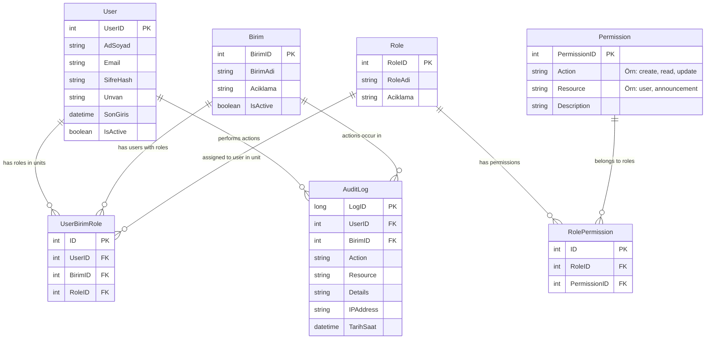

# Entity-Relationship Diagram (ERD) - Kurumsal İntranet Web Portalı

Bu doküman, **Kurumsal İntranet Web Portalı** projesinin veritabanı şemasını, varlık ilişkilerini ve Rol Bazlı Erişim Kontrolü (RBAC) modelini tanımlar.

## 1. Genel Bakış

Sistem, **Çok Birimli (Multi-Unit)** ve **Rol Bazlı (RBAC)** bir yapıya sahiptir.

- Bir kullanıcı birden fazla birime atanabilir.
- Kullanıcının her birimde farklı bir rolü olabilir.
- Yetkiler (Permissions) rollere atanır, kullanıcılar rollere sahip olur.

## 2. Varlıklar (Entities)

### 2.1. Temel Tablolar

| Tablo Adı | Açıklama |
|-----------|----------|
| **User** | Sisteme giriş yapan kullanıcıların temel bilgilerini tutar. |
| **Birim** | Kurum içindeki departman veya birimleri temsil eder. |
| **Role** | Sistemdeki yetki gruplarını tanımlar (Örn: Sistem Admin, Birim Admin, Editör). |
| **Permission** | Sistemdeki atomik yetkileri tanımlar (Örn: `user.create`, `content.view`). |

### 2.2. İlişki Tabloları (Junction Tables)

| Tablo Adı | Açıklama |
|-----------|----------|
| **UserBirimRole** | **(Çok Önemli)** Kullanıcının hangi birimde hangi role sahip olduğunu belirler. Kullanıcı-Birim-Rol üçlüsünü bağlar. |
| **RolePermission** | Hangi rolün hangi yetkilere sahip olduğunu belirler. |

### 2.3. Loglama

| Tablo Adı | Açıklama |
|-----------|----------|
| **AuditLog** | Kullanıcıların yaptığı kritik işlemleri ve sistem olaylarını kayıt altına alır. |

## 3. Veritabanı Şeması (ER Diagram)

Aşağıdaki diyagram, tablolar arasındaki ilişkileri ve kardinaliteleri göstermektedir.



## 4. İlişki Detayları ve Kurallar

### 4.1. Çok Birimli Kullanıcı Yapısı (UserBirimRole)

Bu yapı, bir kullanıcının farklı birimlerde farklı yetkilere sahip olmasını sağlar.
- **Örnek Senaryo:**
  - `Ahmet` kullanıcısı `Bilgi İşlem` biriminde `Birim Admin` olabilir.
  - Aynı `Ahmet` kullanıcısı `İnsan Kaynakları` biriminde sadece `Birim Görüntüleyici` olabilir.
- **Kısıt:** `UserID` + `BirimID` çifti için genellikle tek bir `RoleID` aktif olur (veya birden fazla rol desteklenecekse bu tabloya birden fazla kayıt atılır). Basitlik için her birimde tek rol önerilir.

### 4.2. RBAC (Role-Based Access Control)

* **RolePermission:** Roller doğrudan yetkilerle eşleşir.
- **Kontrol Mekanizması:**
    1. Kullanıcı login olur.
    2. Birim seçer (Örn: Bilgi İşlem).
    3. Sistem `UserBirimRole` tablosundan kullanıcının o birimdeki `RoleID`sini bulur.
    4. `RolePermission` tablosundan o role ait `Permission` listesi çekilir.
    5. Frontend ve Backend bu permission listesine göre erişim verir.

### 4.3. Audit Log

* Her işlemde `UserID` ve işlem yapılan `BirimID` kaydedilmelidir.
- Bu sayede "Hangi kullanıcı, hangi birimdeyken, ne yaptı?" sorusu cevaplanabilir.

---

## 5. SQL Tablo Şemaları (PostgreSQL)

### 5.1. User Tablosu

```sql
CREATE TABLE "User" (
    "UserID" SERIAL PRIMARY KEY,
    "AdSoyad" VARCHAR(100) NOT NULL,
    "Email" VARCHAR(150) UNIQUE NOT NULL,
    "SifreHash" VARCHAR(255) NOT NULL,
    "Unvan" VARCHAR(100),
    "SonGiris" TIMESTAMP,
    "IsActive" BOOLEAN DEFAULT TRUE,
    "CreatedAt" TIMESTAMP DEFAULT CURRENT_TIMESTAMP,
    "UpdatedAt" TIMESTAMP DEFAULT CURRENT_TIMESTAMP
);

-- İndeksler
CREATE INDEX idx_user_email ON "User"("Email");
CREATE INDEX idx_user_active ON "User"("IsActive");
```

### 5.2. Birim Tablosu

```sql
CREATE TABLE "Birim" (
    "BirimID" SERIAL PRIMARY KEY,
    "BirimAdi" VARCHAR(100) UNIQUE NOT NULL,
    "Aciklama" TEXT,
    "IsActive" BOOLEAN DEFAULT TRUE,
    "CreatedAt" TIMESTAMP DEFAULT CURRENT_TIMESTAMP,
    "UpdatedAt" TIMESTAMP DEFAULT CURRENT_TIMESTAMP
);

-- İndeks
CREATE INDEX idx_birim_active ON "Birim"("IsActive");
```

### 5.3. Role Tablosu

```sql
CREATE TABLE "Role" (
    "RoleID" SERIAL PRIMARY KEY,
    "RoleAdi" VARCHAR(50) UNIQUE NOT NULL,
    "Aciklama" TEXT,
    "CreatedAt" TIMESTAMP DEFAULT CURRENT_TIMESTAMP
);

-- Varsayılan Roller
INSERT INTO "Role" ("RoleAdi", "Aciklama") VALUES
('SistemAdmin', 'Tüm sistem yöneticisi'),
('BirimAdmin', 'Birim yöneticisi'),
('BirimEditor', 'İçerik ekleyen/güncelleyen'),
('BirimGoruntuleyen', 'Sadece görüntüleme yetkisi');
```

### 5.4. Permission Tablosu

```sql
CREATE TABLE "Permission" (
    "PermissionID" SERIAL PRIMARY KEY,
    "Action" VARCHAR(50) NOT NULL,  -- create, read, update, delete
    "Resource" VARCHAR(100) NOT NULL,  -- user, content, announcement, etc.
    "Description" TEXT,
    CONSTRAINT unique_action_resource UNIQUE ("Action", "Resource")
);

-- Örnek Yetkiler
INSERT INTO "Permission" ("Action", "Resource", "Description") VALUES
('create', 'user', 'Kullanıcı oluşturma yetkisi'),
('read', 'user', 'Kullanıcı görüntüleme yetkisi'),
('update', 'user', 'Kullanıcı güncelleme yetkisi'),
('delete', 'user', 'Kullanıcı silme yetkisi'),
('create', 'announcement', 'Duyuru oluşturma yetkisi'),
('read', 'announcement', 'Duyuru görüntüleme yetkisi'),
('update', 'announcement', 'Duyuru güncelleme yetkisi'),
('delete', 'announcement', 'Duyuru silme yetkisi'),
('read', 'auditlog', 'Audit log görüntüleme yetkisi'),
('manage', 'birim', 'Birim yönetimi yetkisi');

-- İndeks
CREATE INDEX idx_permission_resource ON "Permission"("Resource");
```

### 5.5. UserBirimRole Tablosu (Many-to-Many İlişki)

```sql
CREATE TABLE "UserBirimRole" (
    "ID" SERIAL PRIMARY KEY,
    "UserID" INTEGER NOT NULL,
    "BirimID" INTEGER NOT NULL,
    "RoleID" INTEGER NOT NULL,
    "AssignedAt" TIMESTAMP DEFAULT CURRENT_TIMESTAMP,

    CONSTRAINT fk_ubr_user FOREIGN KEY ("UserID")
        REFERENCES "User"("UserID") ON DELETE CASCADE,
    CONSTRAINT fk_ubr_birim FOREIGN KEY ("BirimID")
        REFERENCES "Birim"("BirimID") ON DELETE CASCADE,
    CONSTRAINT fk_ubr_role FOREIGN KEY ("RoleID")
        REFERENCES "Role"("RoleID") ON DELETE CASCADE,

    -- Bir kullanıcı aynı birimde aynı role birden fazla kez atanamaz
    CONSTRAINT unique_user_birim_role UNIQUE ("UserID", "BirimID", "RoleID")
);

-- İndeksler (Performans için kritik)
CREATE INDEX idx_ubr_user ON "UserBirimRole"("UserID");
CREATE INDEX idx_ubr_birim ON "UserBirimRole"("BirimID");
CREATE INDEX idx_ubr_user_birim ON "UserBirimRole"("UserID", "BirimID");
```

### 5.6. RolePermission Tablosu

```sql
CREATE TABLE "RolePermission" (
    "ID" SERIAL PRIMARY KEY,
    "RoleID" INTEGER NOT NULL,
    "PermissionID" INTEGER NOT NULL,
    "GrantedAt" TIMESTAMP DEFAULT CURRENT_TIMESTAMP,

    CONSTRAINT fk_rp_role FOREIGN KEY ("RoleID")
        REFERENCES "Role"("RoleID") ON DELETE CASCADE,
    CONSTRAINT fk_rp_permission FOREIGN KEY ("PermissionID")
        REFERENCES "Permission"("PermissionID") ON DELETE CASCADE,

    CONSTRAINT unique_role_permission UNIQUE ("RoleID", "PermissionID")
);

-- İndeks
CREATE INDEX idx_rp_role ON "RolePermission"("RoleID");
```

### 5.7. AuditLog Tablosu

```sql
CREATE TABLE "AuditLog" (
    "LogID" BIGSERIAL PRIMARY KEY,
    "UserID" INTEGER,
    "BirimID" INTEGER,
    "Action" VARCHAR(100) NOT NULL,  -- Login, CreateUser, UpdateContent, etc.
    "Resource" VARCHAR(100),  -- User, Announcement, etc.
    "Details" JSONB,  -- Ek detaylar (JSON formatında)
    "IPAddress" VARCHAR(45),  -- IPv4 veya IPv6
    "TarihSaat" TIMESTAMP DEFAULT CURRENT_TIMESTAMP,

    CONSTRAINT fk_log_user FOREIGN KEY ("UserID")
        REFERENCES "User"("UserID") ON DELETE SET NULL,
    CONSTRAINT fk_log_birim FOREIGN KEY ("BirimID")
        REFERENCES "Birim"("BirimID") ON DELETE SET NULL
);

-- İndeksler (Loglarda arama performansı için)
CREATE INDEX idx_log_user ON "AuditLog"("UserID");
CREATE INDEX idx_log_birim ON "AuditLog"("BirimID");
CREATE INDEX idx_log_date ON "AuditLog"("TarihSaat" DESC);
CREATE INDEX idx_log_action ON "AuditLog"("Action");

-- JSONB indeksi (Details alanında arama için)
CREATE INDEX idx_log_details ON "AuditLog" USING GIN ("Details");
```

### 5.8. IPWhitelist Tablosu (Opsiyonel - IP yönetimi için)

```sql
CREATE TABLE "IPWhitelist" (
    "ID" SERIAL PRIMARY KEY,
    "IPRange" VARCHAR(50) NOT NULL,  -- CIDR formatı: 192.168.1.0/24
    "Description" TEXT,
    "IsActive" BOOLEAN DEFAULT TRUE,
    "CreatedAt" TIMESTAMP DEFAULT CURRENT_TIMESTAMP
);

-- Örnek kayıtlar
INSERT INTO "IPWhitelist" ("IPRange", "Description") VALUES
('192.168.1.0/24', 'Merkez ofis ağı'),
('10.0.0.0/16', 'Şube ağları');
```

---

## 6. Örnek Veri Senaryoları

### Senaryo 1: Ahmet - Çok Birimli Kullanıcı

**Durum:** Ahmet hem Bilgi İşlem biriminde admin, hem İK biriminde görüntüleyici.

```sql
-- 1. Kullanıcı kaydı
INSERT INTO "User" ("AdSoyad", "Email", "SifreHash", "Unvan")
VALUES ('Ahmet Yılmaz', 'ahmet@kurum.local', '$2a$12$hashed...', 'Kıdemli IT Uzmanı');
-- UserID = 1

-- 2. Birimler
INSERT INTO "Birim" ("BirimAdi") VALUES ('Bilgi İşlem'), ('İnsan Kaynakları');
-- BirimID 101, 102

-- 3. Roller
-- RoleID 1: SistemAdmin
-- RoleID 2: BirimAdmin
-- RoleID 4: BirimGoruntuleyen

-- 4. Ahmet'in birim ve rol atamaları
INSERT INTO "UserBirimRole" ("UserID", "BirimID", "RoleID") VALUES
(1, 101, 2),  -- Bilgi İşlem'de Birim Admin
(1, 102, 4);  -- İnsan Kaynakları'nda Görüntüleyici
```

**Sorgu:** Ahmet'in birimleri ve rolleri:
```sql
SELECT
    u."AdSoyad",
    b."BirimAdi",
    r."RoleAdi"
FROM "User" u
JOIN "UserBirimRole" ubr ON u."UserID" = ubr."UserID"
JOIN "Birim" b ON ubr."BirimID" = b."BirimID"
JOIN "Role" r ON ubr."RoleID" = r."RoleID"
WHERE u."Email" = 'ahmet@kurum.local';
```

### Senaryo 2: Birim Admin Yetki Kontrolü

**Durum:** "Bilgi İşlem BirimAdmin'i hangi yetkilere sahip?"

```sql
-- BirimAdmin rolünün (RoleID=2) tüm yetkilerini getir
SELECT
    r."RoleAdi",
    p."Action",
    p."Resource",
    p."Description"
FROM "Role" r
JOIN "RolePermission" rp ON r."RoleID" = rp."RoleID"
JOIN "Permission" p ON rp."PermissionID" = p."PermissionID"
WHERE r."RoleAdi" = 'BirimAdmin';
```

### Senaryo 3: Audit Log Sorgulama

**Durum:** "Son 7 günde kimler kullanıcı oluşturdu?"

```sql
SELECT
    u."AdSoyad",
    b."BirimAdi",
    al."Action",
    al."Details",
    al."TarihSaat"
FROM "AuditLog" al
LEFT JOIN "User" u ON al."UserID" = u."UserID"
LEFT JOIN "Birim" b ON al."BirimID" = b."BirimID"
WHERE al."Action" = 'CreateUser'
  AND al."TarihSaat" >= NOW() - INTERVAL '7 days'
ORDER BY al."TarihSaat" DESC;
```

---

## 7. Veritabanı Kısıtlamaları ve Kurallar

### 7.1. Veri Bütünlüğü Kuralları

1. **Kullanıcı Silme (Soft Delete Önerisi):**
   - Kullanıcılar `IsActive = FALSE` yapılarak pasife alınmalı, fiziksel olarak silinmemeli.

2. **Cascade Kuralları:**
   - Kullanıcı silinirse → `UserBirimRole` kayıtları da silinir (`ON DELETE CASCADE`)
   - Birim silinirse → O birime ait `UserBirimRole` kayıtları silinir
   - Rol silinirse → `RolePermission` ve `UserBirimRole` kayıtları silinir

3. **Unique Constraints:**
   - `User.Email` benzersiz olmalı
   - `Birim.BirimAdi` benzersiz olmalı
   - `(UserID, BirimID, RoleID)` üçlüsü benzersiz (Aynı kullanıcı aynı birimde aynı role birden fazla kez atanamaz)

### 7.2. Performans İçin Index Stratejisi

**Kritik İndeksler:**
- `User(Email)` - Login sorguları için
- `UserBirimRole(UserID, BirimID)` - Composite index (En sık kullanılan sorgu)
- `RolePermission(RoleID)` - RBAC kontrolleri için
- `AuditLog(TarihSaat DESC)` - Log sorgularında tarih filtreleme

---

## 8. Veritabanı Bakım ve Optimizasyon

### 8.1. Yedekleme Scripti (Windows Task Scheduler ile)

```powershell
# PostgreSQL Yedekleme Script (backup.ps1)
$date = Get-Date -Format "yyyy-MM-dd"
$backupPath = "C:\Backups\IntranetDB_$date.backup"

& "C:\Program Files\PostgreSQL\16\bin\pg_dump.exe" `
    -U intranet_user `
    -h localhost `
    -F c `
    -b -v `
    -f $backupPath `
    IntranetDB

# Eski yedekleri temizle (30 günden eski)
Get-ChildItem "C:\Backups\" -Filter "IntranetDB_*.backup" |
    Where-Object { $_.LastWriteTime -lt (Get-Date).AddDays(-30) } |
    Remove-Item
```

### 8.2. Partitioning (AuditLog için - Opsiyonel)

```sql
-- Aylık partition ile AuditLog tablosunu bölümleme
CREATE TABLE "AuditLog" (
    -- Kolonlar aynı
) PARTITION BY RANGE ("TarihSaat");

-- Her ay için partition oluşturma
CREATE TABLE "AuditLog_2025_01" PARTITION OF "AuditLog"
    FOR VALUES FROM ('2025-01-01') TO ('2025-02-01');

CREATE TABLE "AuditLog_2025_02" PARTITION OF "AuditLog"
    FOR VALUES FROM ('2025-02-01') TO ('2025-03-01');
```

---

Bu ERD ve SQL şema dokümanı, sistemin veritabanı yapısını tam olarak tanımlar ve geliştiricilere hazır SQL scriptleri sunar.
