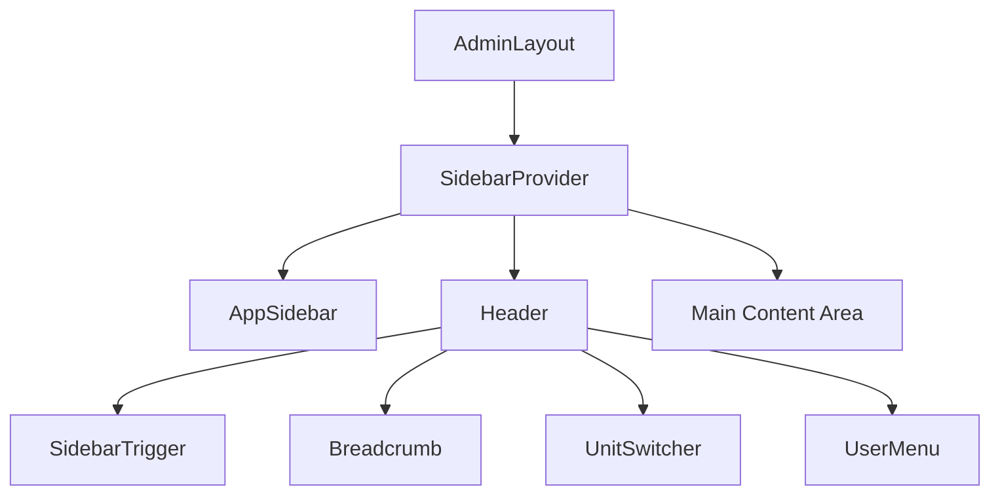

# Technical Design: Multi-Unit Navigation & Layout Refactoring

## 1. Overview
This design outlines the integration of the "Multi-Unit Navigation" feature for Phase 4. The goal is to allow users to switch between assigned units (Birims) seamlessly without re-logging, while ensuring the UI (Sidebar, Header, Dashboard) reflects the selected unit's context (permissions, data).

## 2. Architecture

### 2.1. Layout Structure (AdminLayout)
The application uses a persistent `AdminLayout` that wraps all authenticated routes.
*   **Current State:** Uses a hardcoded, inline header within `AdminLayout.tsx`.
*   **Target State:** Will use the dedicated `src/shared/components/Header.tsx` component.

### 2.2. State Management (Zustand)
*   `authStore` holds `user`, `birimleri`, `selectedBirim`, and `currentRoleInfo`.
*   When `selectBirim` is called (via Header), `selectedBirim` and `currentRoleInfo` are updated.
*   `AppSidebar` subscribes to `authStore`. It uses `usePermission` (which depends on `currentRoleInfo`) to filter menu items dynamically. **No sidebar code changes required for logic.**

## 3. Component Design

### 3.1. Header Component (`src/shared/components/Header.tsx`)
**Responsibilities:**
1.  **Sidebar Control:** Must include `<SidebarTrigger />` (currently missing).
2.  **Navigation Context:** Must include `<Breadcrumb />` (currently placeholder).
3.  **Unit Switching:** Already implemented. Handles API call `authApi.selectBirim` and store update.
4.  **User Menu:** Already implemented.

**Modifications Required:**
*   Import `SidebarTrigger` from `@/components/ui/sidebar`.
*   Import Breadcrumb components.
*   Implement `getPageTitle()` logic (or prop) to display current page context dynamically.
*   Style updates to match the clean look of the previous inline header.

### 3.2. AdminLayout Component (`src/shared/layouts/AdminLayout.tsx`)
**Responsibilities:**
1.  Provide `SidebarProvider`.
2.  Render `AppSidebar`.
3.  Render the new `Header`.
4.  Render `Outlet`.

**Modifications Required:**
*   Remove the inline `<header>` block entirely.
*   Import and render `<Header />`.
*   Pass `isDarkMode` and `toggleTheme` to `AppSidebar` (already doing this).
*   *Note:* `Header` might need access to route location for Breadcrumbs. It can use `useLocation` internally.

## 4. Implementation Steps

1.  **Update `Header.tsx`:**
    *   Add `SidebarTrigger` to the left side.
    *   Add `Breadcrumb` logic (migrated from `AdminLayout.tsx`).
    *   Ensure responsive design (hide breadcrumbs on mobile if needed).
2.  **Update `AdminLayout.tsx`:**
    *   Replace inline header with `<Header />`.
3.  **Verify Flow:**
    *   Login as multi-unit user.
    *   Select Unit A -> Sidebar shows Unit A menus.
    *   Use Header Dropdown -> Select Unit B.
    *   Verify Toast "Birim değiştirildi".
    *   Verify Sidebar updates to Unit B menus automatically.
    *   Verify Dashboard data reloads (handled by React Query/useEffect due to dependency on context or page reload in `Header.tsx`).

## 5. Security & Performance
*   **Security:** Unit switching invokes `authApi.selectBirim`, ensuring the backend validates the switch and issues a new context (cookie/token update) if necessary.
*   **Performance:** `Header.tsx` currently does `navigate('/dashboard')` after switch. This is good as it resets the view state. `window.location.reload()` is not needed unless the frontend state is deeply desynchronized (which Zustand persists prevents).

## 6. Approval
This design leverages the existing robust architecture and requires minimal new code, focusing instead on component integration.
